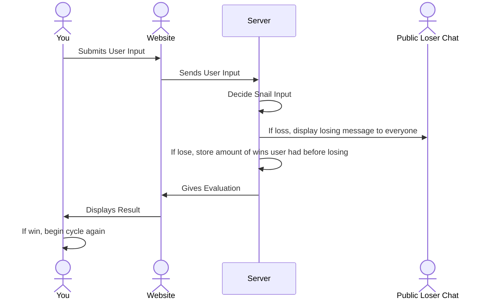

# Rock Paper Snail

[My Notes](notes.md)

I really wanted to play rock paper scissors but with a snail because I thought it would be funny so that will be the entire point of my project. Users will log in, then I'll have like 4 images for gerald the snail and some sprites for the users hand, and it'll just be a pretty simple game of rock paper scissors. I think it's unique enough while not being overcomplex so that I can focus on learning the other parts of the course.

## 🚀 Specification Deliverable

For this deliverable I did the following. I checked the box `[x]` and added a description for things I completed.

- [x] Proper use of Markdown
- [x] A concise and compelling elevator pitch
- [x] Description of key features
- [x] Description of how you will use each technology
- [x] One or more rough sketches of your application. Images must be embedded in this file using Markdown image references.

### Elevator pitch

The year is 2025, and you have been selected to help test the brand new product snail-who-can-play-rock-paper-scissors. Go test your wits against our professional snail and then compare your score with others around the world. Do you have what it takes to beat a snail in rock paper scissors? I sure hope so if not that would be pretty embarrasing.

### Design

Below is a diagram explaining how the main function of the website being the rock paper scissors game will be handled.
Read diagram from top to bottom.

### Key features

- Leaderboard of how many games people have won against the snail.
- Messaging system that lets you know when your friends have lost to the snail so you can make fun of them.
- User can choose between Rock Paper or Scissors.
- Snail that randomly chooses between Rock Paper or Scissors.
- Visual system for indicating what choice has been made by Snail and User.
- Secure Account creation and Login capabilities.

### Technologies

I am going to use the required technologies in the following ways.

- **HTML** - Overall structure of site, will contain three pages. One for signing in, one for the game page, one for leaderboard.
- **CSS** - Styling of application that fits on different screen sizes, correct spacing, and good color choice.
- **React** - Ability to login, display of the current match of rock paper sicssors, leaderboard display, and loser chat display.
- **Service** - Use of external source Colormind to make theme of website change, Backend service that will handle
  - login
  - receiving user input
  - evaluates match of rock paper scissors
- **DB/Login** - Stores users credentials and high score in database. User cannot play against the snail without an account, to avoid errors in storing highscores for nonexistent users.
- **WebSocket** - When a user loses against the snail, it will be displayed to all other users.

## 🚀 AWS deliverable

For this deliverable I did the following. I checked the box `[x]` and added a description for things I completed.

- [x] **Server deployed and accessible with custom domain name** - [My server link](https://rockpapersnail.click).

## 🚀 HTML deliverable

For this deliverable I did the following. I checked the box `[x]` and added a description for things I completed.

- [x] **HTML pages** - Added 3 pages for the website to navigate.
- [x] **Proper HTML element usage** - Everything is nice and organized!
- [x] **Links** - Links allow you to navigate between parts of the site. Github link is there too.
- [x] **Text** - Placeholder texts exists for the site as well as titles among other things.
- [x] **3rd party API placeholder** - Okay so I want to use colormind for this so not much of a change yet.
- [x] **Images** - There are images for the snail and rock papers scissors.
- [x] **Login placeholder** - Placeholder for login exists.
- [x] **DB data placeholder** - Leaderboard page.
- [x] **WebSocket placeholder** - The snail loser chat is in place.

## 🚀 CSS deliverable

For this deliverable I did the following. I checked the box `[x]` and added a description for things I completed.

- [x] **Header, footer, and main content body** - I've got everything organized into a header footer and main. Visually I didn't add like distinct bars since I'm going for a different kind of look.
- [x] **Navigation elements** - I've got a navigation bar at the top of the play and leaderboard page.
- [x] **Responsive to window resizing** - Everything scales according to the screen and I hide some elements if it's too small.
- [x] **Application elements** - I'm guessing this means like my leaderboard, loser chat, etc? If so all of that has been formated to how I want it.
- [x] **Application text content** - I learned how to add a nice shadow behind text so a lot of my site uses white text with a black gradient behind it to make it pop out so that's neat..
- [x] **Application images** - The snail, rock, paper, scissors images are all in place and scale correctly.

## 🚀 React part 1: Routing deliverable

For this deliverable I did the following. I checked the box `[x]` and added a description for things I completed.

- [x] **Bundled using Vite** - Both my simon and startup are bundled with vite
- [x] **Components** - All my bootstrap stuff works properly here and is ready to go!
- [x] **Router** - Routing between my play and leaderboard, I purposefully don't have a way to get back to Login since I don't think it's needed.

## 🚀 React part 2: Reactivity

For this deliverable I did the following. I checked the box `[x]` and added a description for things I completed.

- [x] **All functionality implemented or mocked out** - Got the stuff mocked out for the little loser box the leaderboard playing rock paper scissors the whole nine yards.
- [x] **Hooks** -We are now ready for a new color to be decided whenever colormind is used just need to add it later

## 🚀 Service deliverable

For this deliverable I did the following. I checked the box `[x]` and added a description for things I completed.

- [x] **Node.js/Express HTTP service** - Node js is all setup and express was properly installed.
- [x] **Static middleware for frontend** - Set it up so there is middleware that serves it up to public view.
- [x] **Calls to third party endpoints** - Colormind is called to change color scheme of website everytime it's opened.
- [x] **Backend service endpoints** - Setup all the endpoints needed for keeping score and being able to login to the site.
- [x] **Frontend calls service endpoints** - Login frontend and score and play frontends interact with the backend properly.

## 🚀 DB/Login deliverable

For this deliverable I did the following. I checked the box `[x]` and added a description for things I completed.

- [x] **User registration** - Users can create an account on the website
- [x] **User login and logout** - Users can sign in with an account created and logout to!
- [x] **Stores data in MongoDB** - High scores are stored in the database
- [x] **Stores credentials in MongoDB** - Users creds are stored in MongoDB
- [x] **Restricts functionality based on authentication** - You can't play against the Snail unless you sign in.

## 🚀 WebSocket deliverable

For this deliverable I did the following. I checked the box `[x]` and added a description for things I completed.

- [x] **Backend listens for WebSocket connection** - The server has a peer proxy thing just like Simons! I stepped through it though and made sure I understood what it was doing.
- [x] **Frontend makes WebSocket connection** - When playing we make a connection to the websocket so we can see all the losers
- [x] **Data sent over WebSocket connection** - Whenever the user loses to the snail it sends it to everyone else
- [x] **WebSocket data displayed** - When the users receive a loser message it appears in the loser box in the top left of the window
- [x] **Application is fully functional** - Everything for rock paper snail is working!

## Possible Add-Ons
- [] **Make more visual feedback for play session**
- [] **Avoid darker colors for the website so top bar is visible**