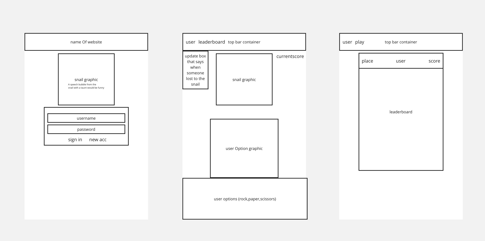
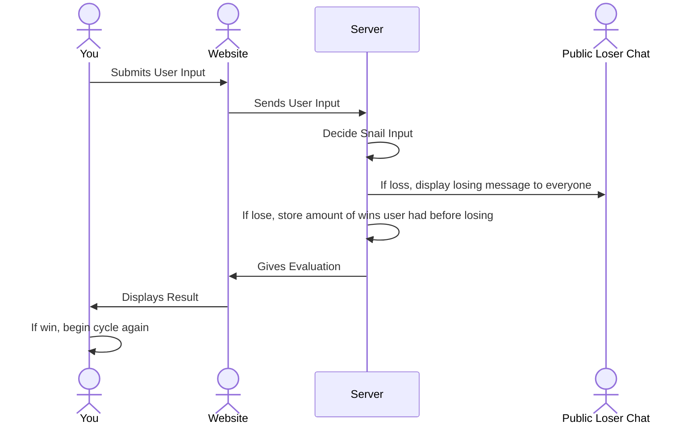

# Rock Paper Snail

[My Notes](notes.md)

I really wanted to play rock paper scissors but with a snail because I thought it would be funny so that will be the entire point of my project. Users will log in, then I'll have like 4 images for gerald the snail and some sprites for the users hand, and it'll just be a pretty simple game of rock paper scissors. I think it's unique enough while not being overcomplex so that I can focus on learning the other parts of the course.

## 🚀 Specification Deliverable

For this deliverable I did the following. I checked the box `[x]` and added a description for things I completed.

- [x] Proper use of Markdown
- [x] A concise and compelling elevator pitch
- [x] Description of key features
- [x] Description of how you will use each technology
- [x] One or more rough sketches of your application. Images must be embedded in this file using Markdown image references.

### Elevator pitch

The year is 2025, and you have been selected to help test the brand new product snail-who-can-play-rock-paper-scissors. Go test your wits against our professional snail and then compare your score with others around the world. Do you have what it takes to beat a snail in rock paper scissors? I sure hope so if not that would be pretty embarrasing.

### Design

Below is a diagram explaining how the main function of the website being the rock paper scissors game will be handled.
Read diagram from top to bottom.

### Key features

- Leaderboard of how many games people have won against the snail.
- Messaging system that lets you know when your friends have lost to the snail so you can make fun of them.
- User can choose between Rock Paper or Scissors.
- Snail that randomly chooses between Rock Paper or Scissors.
- Visual system for indicating what choice has been made by Snail and User.
- Secure Account creation and Login capabilities.

### Technologies

I am going to use the required technologies in the following ways.

- **HTML** - Overall structure of site, will contain three pages. One for signing in, one for the game page, one for leaderboard.
- **CSS** - Styling of application that fits on different screen sizes, correct spacing, and good color choice.
- **React** - Ability to login, display of the current match of rock paper sicssors, leaderboard display, and loser chat display.
- **Service** - Use of external source Colormind to make theme of website change, Backend service that will handle
  - login
  - receiving user input
  - evaluates match of rock paper scissors
- **DB/Login** - Stores users credentials and high score in database. User cannot play against the snail without an account, to avoid errors in storing highscores for nonexistent users.
- **WebSocket** - When a user loses against the snail, it will be displayed to all other users.

## 🚀 AWS deliverable

For this deliverable I did the following. I checked the box `[x]` and added a description for things I completed.

- [x] **Server deployed and accessible with custom domain name** - [My server link](https://rockpapersnail.click).

## 🚀 HTML deliverable

For this deliverable I did the following. I checked the box `[x]` and added a description for things I completed.

- [ ] **HTML pages** - I did not complete this part of the deliverable.
- [ ] **Proper HTML element usage** - I did not complete this part of the deliverable.
- [ ] **Links** - I did not complete this part of the deliverable.
- [ ] **Text** - I did not complete this part of the deliverable.
- [ ] **3rd party API placeholder** - I did not complete this part of the deliverable.
- [ ] **Images** - I did not complete this part of the deliverable.
- [ ] **Login placeholder** - I did not complete this part of the deliverable.
- [ ] **DB data placeholder** - I did not complete this part of the deliverable.
- [ ] **WebSocket placeholder** - I did not complete this part of the deliverable.

## 🚀 CSS deliverable

For this deliverable I did the following. I checked the box `[x]` and added a description for things I completed.

- [ ] **Header, footer, and main content body** - I did not complete this part of the deliverable.
- [ ] **Navigation elements** - I did not complete this part of the deliverable.
- [ ] **Responsive to window resizing** - I did not complete this part of the deliverable.
- [ ] **Application elements** - I did not complete this part of the deliverable.
- [ ] **Application text content** - I did not complete this part of the deliverable.
- [ ] **Application images** - I did not complete this part of the deliverable.

## 🚀 React part 1: Routing deliverable

For this deliverable I did the following. I checked the box `[x]` and added a description for things I completed.

- [ ] **Bundled using Vite** - I did not complete this part of the deliverable.
- [ ] **Components** - I did not complete this part of the deliverable.
- [ ] **Router** - Routing between login and voting components.

## 🚀 React part 2: Reactivity

For this deliverable I did the following. I checked the box `[x]` and added a description for things I completed.

- [ ] **All functionality implemented or mocked out** - I did not complete this part of the deliverable.
- [ ] **Hooks** - I did not complete this part of the deliverable.

## 🚀 Service deliverable

For this deliverable I did the following. I checked the box `[x]` and added a description for things I completed.

- [ ] **Node.js/Express HTTP service** - I did not complete this part of the deliverable.
- [ ] **Static middleware for frontend** - I did not complete this part of the deliverable.
- [ ] **Calls to third party endpoints** - I did not complete this part of the deliverable.
- [ ] **Backend service endpoints** - I did not complete this part of the deliverable.
- [ ] **Frontend calls service endpoints** - I did not complete this part of the deliverable.

## 🚀 DB/Login deliverable

For this deliverable I did the following. I checked the box `[x]` and added a description for things I completed.

- [ ] **User registration** - I did not complete this part of the deliverable.
- [ ] **User login and logout** - I did not complete this part of the deliverable.
- [ ] **Stores data in MongoDB** - I did not complete this part of the deliverable.
- [ ] **Stores credentials in MongoDB** - I did not complete this part of the deliverable.
- [ ] **Restricts functionality based on authentication** - I did not complete this part of the deliverable.

## 🚀 WebSocket deliverable

For this deliverable I did the following. I checked the box `[x]` and added a description for things I completed.

- [ ] **Backend listens for WebSocket connection** - I did not complete this part of the deliverable.
- [ ] **Frontend makes WebSocket connection** - I did not complete this part of the deliverable.
- [ ] **Data sent over WebSocket connection** - I did not complete this part of the deliverable.
- [ ] **WebSocket data displayed** - I did not complete this part of the deliverable.
- [ ] **Application is fully functional** - I did not complete this part of the deliverable.
